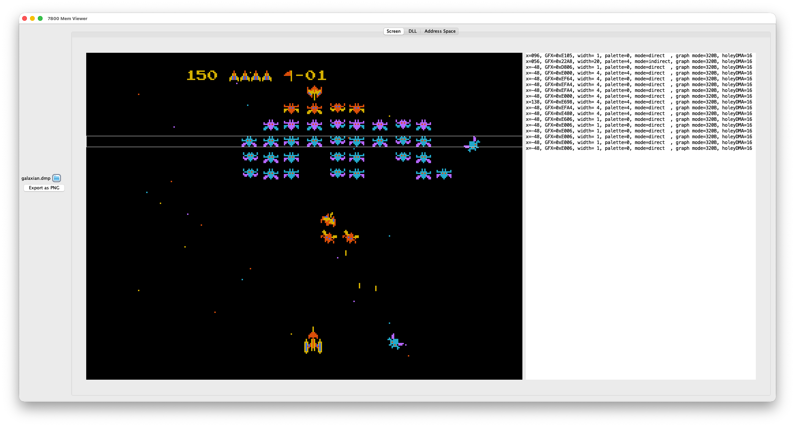
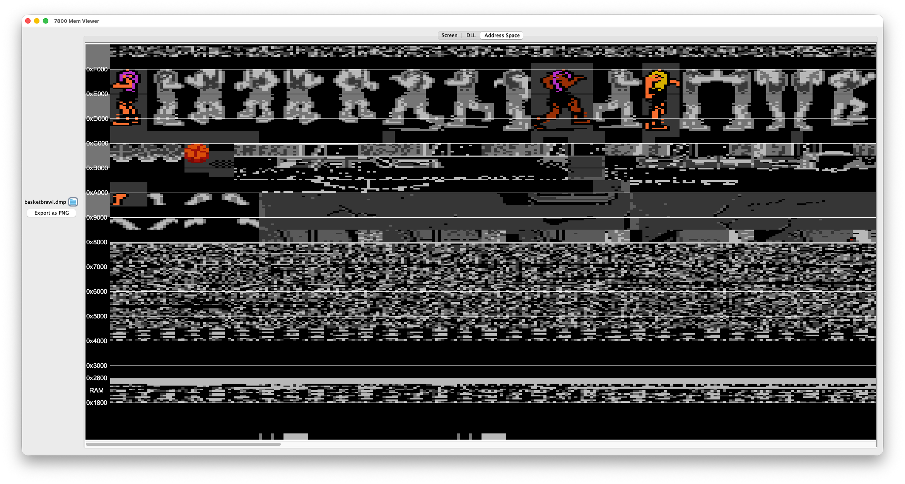

# 7800 Mem Viewer

This utility allows to examine the memory of a 7800 game.

## How to use it

This utility is executed by either `run.sh` or `run.bat` and requires two files:

- A memory dump of the desired game, generated in MAME/A7800 by the debug command `save mygame.dmp,0,10000`
- A JSON file which contains information such as the DLL address (see examples)
